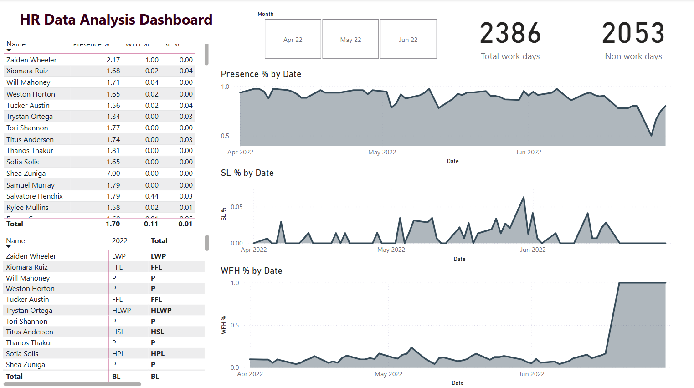

# 📊 HR Data Analysis Dashboard (Power BI) 

An interactive Power BI dashboard that turns monthly employee attendance sheets into a single view of **presence, work-from-home (WFH) and sick leave (SL)** for **April – June 2022**. HR can see company-wide trends by date and drill into each employee's attendance record.



**Business questions answered**

- How does attendance and WFH usage change month over month?
- Which weekdays see the most WFH and leave?
- Which days have the highest sick leave?

📄 A one-page summary of the findings is in [`HR Insight Summary.pdf`](HR%20Insight%20Summary.pdf).

---

## 📌 Table of Contents

- [Dataset](#-dataset)
- [Attendance Codes](#-attendance-codes)
- [Dashboard Components](#-dashboard-components)
- [Data Preparation (Power Query)](#-data-preparation-power-query)
- [Data Model & DAX](#-data-model--dax)
- [Key Insights](#-key-insights)
- [Known Limitations](#-known-limitations)
- [How to Use](#-how-to-use)
- [Repository Structure](#-repository-structure)
- [Future Improvements](#-future-improvements)
- [Author](#-author)

---

## 🗂️ Dataset

**Source:** `Attendance Sheet 2022-2023_Masked.xlsx` (employee names are masked).

| Sheet          | Date range in sheet    | Employees |
| -------------- | ---------------------- | --------- |
| Apr 2022       | 1 Apr – 1 May 2022     | 79        |
| May 2022       | 2 May – 1 Jun 2022     | 85        |
| June 2022      | 1 Jun – 30 Jun 2022    | 83        |
| Attendance Key | Lookup of status codes | –         |

- **Layout:** one row per employee, one column per date (wide format), with per-employee summary columns (SL, PL, WFH, LWP, etc.) at the end of each sheet.
- **Size:** 99 unique employee names across the three months; about 6,400 recorded day-entries after removing duplicates.
- **Most common statuses:** Present (P) 3,542 · Weekly Off (WO) 2,053 · WFH 447 · Paid Leave (PL) 144 · LWP 80 · SL 37.

---

## 🏷️ Attendance Codes

Taken from the **Attendance Key** sheet. Half-day codes count as **0.5 day**.

| Code     | Meaning                 | Code     | Meaning                               |
| -------- | ----------------------- | -------- | ------------------------------------- |
| **P**    | Present                 | **LWP**  | Leave without pay                     |
| **WFH**  | Work from home          | **HLWP** | Half-day LWP                          |
| **HWFH** | Half-day WFH            | **BL**   | Birthday leave                        |
| **PL**   | Paid leave              | **BRL**  | Bereavement leave                     |
| **HPL**  | Half-day PL             | **HBRL** | Half bereavement leave                |
| **SL**   | Sick leave              | **ML**   | Menstrual leave                       |
| **HSL**  | Half-day SL             | **HML**  | Half-day ML                           |
| **FFL**  | Floating festival leave | **HFFL** | Half-day floating festival leave      |
| **WO**   | Weekly off              | **HO**   | Holiday off *(not used in this data)* |

---

## 🧩 Dashboard Components

| Component                    | Type       | What it shows                                                            |
| ---------------------------- | ---------- | ------------------------------------------------------------------------ |
| **Month slicer**             | Slicer     | Filters the whole page to Apr 22, May 22 or Jun 22                       |
| **Total work days**          | KPI card   | **2,386**                                                                |
| **Non work days**            | KPI card   | **2,053** (matches the total count of `WO` entries in the source sheets) |
| **Employee summary table**   | Table      | Presence %, WFH % and SL % per employee, with a Total row                |
| **Attendance status matrix** | Matrix     | Each employee's daily status code                                        |
| **Presence % by Date**       | Area chart | Daily presence trend                                                     |
| **SL % by Date**             | Area chart | Daily sick leave trend                                                   |
| **WFH % by Date**            | Area chart | Daily WFH trend                                                          |

---

## 🧹 Data Preparation (Power Query)

1. **Load all three month sheets** and the Attendance Key.
2. **Unpivot the date columns** so each row is `Employee Code | Name | Date | Status`.
3. **Drop the summary columns** at the end of each sheet (they are re-calculated in DAX).
4. **Trim text:** some values and headers have trailing spaces (e.g. `'BL '`, `'BRL '`, `'Employee Code '`, sheet name `'Attendance Key '`).
5. **Remove duplicate dates:** 1 June 2022 appears in both the May and June sheets; keep one row per employee per date. (The two copies never conflict, but the May copy is blank.)
6. **Join** with the Attendance Key to add a status description and a day weight (1 or 0.5).
7. **Add a Calendar table** (Date, Month, Weekday).

---

## 🧮 Data Model & DAX

```
Calendar (1) ──< Attendance (*) >── (1) Employee
                       │
                       └── (*) >── (1) Attendance Key
```

The logic behind the main measures is shown below in simplified form. The exact measures are in `HR_analysis.pbix`.

```
-- Day-equivalents per status group (half-day codes count 0.5)
SL Days  = CALCULATE ( SUM ( Attendance[Weight] ), Attendance[Status] IN { "SL", "HSL" } )
WFH Days = CALCULATE ( SUM ( Attendance[Weight] ), Attendance[Status] IN { "WFH", "HWFH" } )

-- Recorded working days (exclude weekly offs, holidays and blanks)
Working Days Recorded =
CALCULATE (
    COUNTROWS ( Attendance ),
    NOT ( Attendance[Status] IN { "WO", "HO" } ),
    NOT ( ISBLANK ( Attendance[Status] ) )
)

SL %  = DIVIDE ( [SL Days],  [Working Days Recorded] )
WFH % = DIVIDE ( [WFH Days], [Working Days Recorded] )

Non Work Days = CALCULATE ( COUNTROWS ( Attendance ), Attendance[Status] = "WO" )
```

---

## 💡 Key Insights

All figures below were calculated from the source workbook (duplicate 1 June rows removed; rates are over recorded working-day entries).

**Overall**

- About **45 sick-leave days** and **~450 WFH days** were taken across the three months (half-days counted as 0.5), or about **4.5 WFH days per employee** on average.
- WFH share rises month over month: **8.5% (Apr) → 10.0% (May) → 13.5% (Jun)**.
- Sick leave stays very low (**0.4% / 1.4% / 0.7%**), with the biggest single-day spike on **30 May**.

**By day of week**

| Weekday   | WFH rate  | Any-leave rate | SL rate  |
| --------- | --------- | -------------- | -------- |
| Monday    | 9.3%      | 7.3%           | **1.8%** |
| Tuesday   | 8.7%      | 7.3%           | 1.5%     |
| Wednesday | 9.3%      | 8.0%           | 0.9%     |
| Thursday  | 11.8%     | 9.3%           | 1.1%     |
| Friday    | **12.5%** | **9.9%**       | 0.7%     |

- **Friday** has the highest WFH and leave rates, followed by **Thursday**.
- **Sick leave is highest on Mondays** and falls through the week.
- **Tuesday** has the lowest WFH rate.

**Late June caution**

- From about **20 June onward only 4–10 employees have entries** (versus roughly 77–83 earlier in the month), and most of them are WFH. The **WFH % jump to ~100%** and the **dip in presence %** at the end of the charts reflect this thin data, **not** a confirmed company-wide switch to remote work.

---

## ⚠️ Known Limitations

These are open issues in the current version of the report:

- **Presence % is not reliable yet.** Some employee rows show values above 100% (e.g. 1.65, 1.79, 2.17) and one shows a negative value (-7.00). The numerator and denominator of this measure need review (for example, double-counted rows or half-day handling). Use the **WFH %** and **SL %** measures and the daily trend charts for insights; treat Presence % as under review.
- **"Total work days" (2,386)** could not be reproduced from the raw sheets with a simple count, so its exact definition is not yet documented.
- **Blank cells (~1,165)** exist, mainly in late June and for employees who joined or left. The source does not say whether blank means "not employed", "not recorded" or "absent".
- **Names vs. codes:** there are 99 distinct names but only 74 distinct employee codes, likely a side effect of masking. Names are not used as a unique key.
- **Leave reasons are not in the data**, so sick-leave causes cannot be analysed.
- **Status matrix Totals row** shows a single code (e.g. `BL`) because text is being aggregated; it should be hidden for that visual.

---

## 🚀 How to Use

1. Download or clone this repository.
2. Open **`HR_analysis.pbix`** in **Power BI Desktop**.
3. If prompted, update the source path under **Home → Transform data → Data source settings** and point it to `Attendance Sheet 2022-2023_Masked.xlsx`.
4. Click **Refresh**.
5. Use the **Month slicer** to filter every visual.
6. Click an employee in either table to cross-filter the three trend charts.

---

## 📁 Repository Structure

```
HR-Data-Analysis-Dashboard/
├── HR_analysis.pbix                           # Power BI report
├── Attendance Sheet 2022-2023_Masked.xlsx     # Source data (names masked)
├── HR Insight Summary.pdf                     # One-page findings summary
├── HR-Dashboard.png                           # Dashboard screenshot
└── README.md
```

---

## 🔮 Future Improvements

- Fix the Presence % logic so it stays between 0% and 100%, and document the "Total work days" definition.
- Add KPI cards: **Total Sick Leaves**, **Average WFH per Employee** and **Most Preferred Day Off**.
- Add a **weekday analysis** page (WFH, leave and SL by day of week).
- Add a **leave-type breakdown** (PL, SL, LWP, FFL, BL, BRL, ML).
- Load the remaining 2023 months from the workbook for year-over-year trends.
- Show active headcount per day so thin-data days (like late June) are visible.

---

## 👩‍💻 Author

**Sanika Kadam**
[GitHub: @Sanika881](https://github.com/Sanika881) · [LinkedIn](https://www.linkedin.com/in/sanika-kadam007/)
